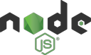

<div id="top"></div>

[![Forks][forks-shield]][forks-url]
[![Stargazers][stars-shield]][stars-url]
[![MIT License][license-shield]][license-url]
[![LinkedIn][linkedin-shield]][linkedin-url]

<!-- PROJECT LOGO -->
<br />
<div align="center">
  <a href="https://github.com/rinaldilucas/node-api-example">
    
  </a>

  <h3 align="center">User Api using Node.js</h3>

  <p align="center">
    Api built with Node.js, Express.js and MongoDB<br> to jumpstart your studies.
    <br />
    <br />
    <a href="https://github.com/rinaldilucas/node-api-example"><strong>Explore the docs »</strong></a>
    <br />   
    <a href="#donations">Donate</a>       
  </p>
</div>

<!-- TABLE OF CONTENTS -->
<details>
  <summary>Table of Contents</summary>
  <ol>
    <li>
      <a href="#about-the-project">About The Project</a>
      <ul>
        <li><a href="#built-with">Built With</a></li>
      </ul>
    </li>
    <li>
      <a href="#getting-started">Getting Started</a>
      <ul>
        <li><a href="#prerequisites">Prerequisites</a></li>
        <li><a href="#installation">Installation</a></li>
      </ul>
    </li>
    <li><a href="#usage">Usage</a></li>
    <li><a href="#contributing">Contributing</a></li>
    <li><a href="#license">License</a></li>
    <li><a href="#contact">Contact</a></li>
    <li><a href="#donations">Donations</a></li>
  </ol>
</details>

<!-- ABOUT THE PROJECT -->

## About The Project


A very simple node project to help people looking for API examples using express.js and mongodb. If this repository helped you, don't hesitate to leave a star!

<p align="right">(<a href="#top">back to top</a>)</p>

### Built With

This section shows what technologies are used in this particular project.

-   [MongoDB](https://www.mongodb.com/)
-   [Express.js](https://expressjs.com/)
-   [NodeJS](https://nodejs.org/en/)

<p align="right">(<a href="#top">back to top</a>)</p>

<!-- GETTING STARTED -->

## Getting Started

After cloning the project, you need to do a few things to be able to run it.

### Prerequisites

You need to have the following requirements:

-   mongodb <a target="_blank" href="https://www.mongodb.com/try/download/community/">(download here)</a>
-   node <a target="_blank" href="https://nodejs.org/en/download/">(download here)</a>

-   npm
    ```sh
    npm install -g npm
    ```
-   nodemon
    ```sh
	npm install -g nodemon
    ```

### Installation

_Below is an example of how you can run the project._

1. Clone the repo
    ```sh
    git clone https://github.com/rinaldilucas/node-api-example.git
    ```
2. Install NPM packages via npm
    ```sh
    npm install
    ```
3. Create a database named usersdb
4. Create a collection named users (or import the `./db/users.json`)
5. Run the api in development mode 
    ```js
    npm run dev
6. Serve the api
    ```js
    npm run build
    ```
7. Serve the api with production environments
    ```js
    npm run build
    ```

<p align="right">(<a href="#top">back to top</a>)</p>

<!-- USAGE EXAMPLES -->

## Usage

You can import the Postman routes via file `./db/postman-collection.json` and import the mongodb collection via file `./db/users.json`.
And below are the implemented routes. You can consult them in `user.routes.js` either.


```js
[GET] localhost:3000/api/users -> 'findAll'
[GET] localhost:3000/api/users/:_id -> 'findById'
[GET] localhost:3000/api/users/email/:email -> 'findByEmail'
[GET] localhost:3000/api/users/username/:username -> 'findByUsername'
[POST] localhost:3000/api/users -> 'create'
[UPDATE] localhost:3000/api/users -> 'update'
[DELETE] localhost:3000/api/users/:_id -> 'delete'
```

<p align="right">(<a href="#top">back to top</a>)</p>

<!-- CONTRIBUTING -->

## Contributing

Contributions are what make the open source community such an amazing place to learn, inspire, and create. Any contributions you make are **greatly appreciated**.

If you have a suggestion that would make this better, please fork the repo and create a pull request. You can also simply open an issue with the tag "enhancement".
Don't forget to give the project a star! Thanks again!

1. Fork the Project
2. Create your Feature Branch (`git checkout -b feature/AmazingFeature`)
3. Commit your Changes (`git commit -m 'Add some AmazingFeature'`)
4. Push to the Branch (`git push origin feature/AmazingFeature`)
5. Open a Pull Request

<p align="right">(<a href="#top">back to top</a>)</p>

<!-- LICENSE -->

## License

Distributed under the MIT License. See [LICENSE](./LICENSE) for more information.

<p align="right">(<a href="#top">back to top</a>)</p>

<!-- CONTACT -->

## Contact

[](https://rinaldilucas.com)
[](https://github.com/rinaldilucas)
[](mailto:lucasreinaldi@gmail.com)
[](mailto:lucasreinaldi@hotmail.com)
[](https://www.linkedin.com/in/rinaldilucas/)
[](https://t.me/rinaldilucas)

Project Link: [https://github.com/rinaldilucas/node-api-example](https://github.com/rinaldilucas/node-api-example)

<p align="right">(<a href="#top">back to top</a>)</p>

<!-- ACKNOWLEDGMENTS -->

## Donations

If you feel that this project has helped you in any way, whether it's attracting clients or teaching you about the technologies used, feel free to make a donation.
It helps me a lot to continue developing open source codes.

-   Metamask (USDT):
    ```sh
    0xA0410641515F06fF6a9AdAFf1c3e90a3905ba271
    ```
-   PIX (BRL):
    ```sh
    72140bc8-fadc-42f5-abb6-9c13cc80a59f
    ```

<p align="right">(<a href="#top">back to top</a>)</p>

<!-- MARKDOWN LINKS & IMAGES -->
<!-- https://www.markdownguide.org/basic-syntax/#reference-style-links -->

[contributors-shield]: https://img.shields.io/github/contributors/rinaldilucas/node-api-example.svg?style=for-the-badge
[contributors-url]: https://github.com/rinaldilucas/node-api-example/graphs/contributors
[forks-shield]: https://img.shields.io/github/forks/rinaldilucas/node-api-example.svg?style=for-the-badge
[forks-url]: https://github.com/rinaldilucas/node-api-example/network/members
[stars-shield]: https://img.shields.io/github/stars/rinaldilucas/node-api-example.svg?style=for-the-badge
[stars-url]: https://github.com/rinaldilucas/node-api-example/stargazers
[license-shield]: https://img.shields.io/github/license/rinaldilucas/node-api-example.svg?style=for-the-badge
[license-url]: https://github.com/rinaldilucas/node-api-example/blob/master/LICENSE.txt
[linkedin-shield]: https://img.shields.io/badge/-LinkedIn-black.svg?style=for-the-badge&logo=linkedin&colorB=555
[linkedin-url]: https://www.linkedin.com/in/rinaldilucas/
[product-screenshot]: sources/images/readme/screenshot.png
